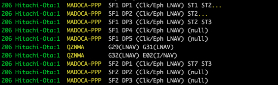

# QZS L6 Tool: quasi-zenith satellite L6-band tool, ver.0.1.0



[English](readme-en.md)

## 概要

- このツール集は、GNSS（測位衛星: Global Navigation Satellite System）のメッセージを表示し、また、GNSS受信機の生データから特定的形式データ（例えばRTCM形式、みちびきL6形式）を抽出します。
- このツール集は、メッセージを標準入力で受け取り、変換結果を逐次的に標準出力に出力するPythonコードからなります。必要に応じて、標準エラー出力も利用できます。
- netcatの``nc``や、[RTKLIB](https://github.com/tomojitakasu/RTKLIB)の``str2str``などと一緒に利用することを想定しています。
- 当初、準天頂衛星みちびき（QZS: quasi-zenith satellite）がL6周波数帯にて放送する補強メッセージ（CLASやMADOCA-PPP）の内容表示を目指していましたが、Galileo HASメッセージなども表示できるようになりました。
- 2024年8月11日バージョンから[セマンテック・バージョニング](https://packaging.python.org/en/latest/discussions/versioning/#choosing-a-versioning-scheme)を導入しました。

## 動作環境

- LinuxやmacOSのコマンドラインで利用することを想定しています。
- Python 3.7以降が必要です。``bitstring``モジュールと``galois``モジュールが必要です。  
``pip3 install bitstring galois``

## 衛星信号表示

| display | code |
|:----:|:-------:|
| RTCM |[rtcmread.py](docs/ja/rtcmread.md) |
| QZSS L6 |[qzsl6read.py](docs/ja/qzsl6read.md) |
| QZSS L1S | [qzsl1sread.py](docs/ja/qzsl1sread.md) |
| Galileo I/NAV | [galinavread.py](docs/ja/galinavread.md) |
| Galileo HAS |[gale6read.py](docs/ja/gale6read.md) |
|BeiDou PPP-B2b | [bdsb2read.py](docs/ja/bdsb2read.md)|

## GNSS受信機データ変換

| GNSS receiver | code | QZS L6 | QZS L1S | Galileo HAS | Galileo I/NAV | BeiDou B2b |
|:----:|:---:| :-------:|:-----------:|:--------:|:---:|:---:|
| Allystar HD9310 option C | [alstread.py](docs/ja/alstread.md) |``-l`` option | | | | |
| [Pocket SDR](https://github.com/tomojitakasu/PocketSDR) | [psdrread.py](docs/ja/psdrread.md) | ``-l`` option |  | ``-e`` option | ``-i`` option| ``-b`` option|
| NovAtel OEM729 | [novread.py](docs/ja/novread.md) | | | ``-e`` option | | |
| Septentrio mosaic-X5 | [septread.py](docs/ja/septread.md) | | | ``-e`` option | | ``-b`` option|
| Septentrio mosaic-CLAS | [septread.py](docs/ja/septread.md) |``-l`` option | | | | |
| u-blox ZED-F9P | [ubxread.py](docs/ja/ubxread.md) | | ``-l1s`` option | | ``-i`` option| |

## 時刻・座標変換

| conversion | code |
|:--:|:--:|
|GPS time, GST, BST &rarr; UTC time | [gps2utc.py](docs/ja/gps2utc.md) |
|UTC time &rarr; GPS time, GST, BST | [utc2gps.py](docs/ja/utc2gps.md)|
|LLH &rarr; ECEF | [llh2ecef.py](docs/ja/llh2ecef.md)|
|ECEF &rarr; LLH | [ecef2llh.py](docs/ja/ecef2llh.md)|

## ディレクトリ構造

```text
├── docs/        (documentation directory)
├── license.txt  (license description)
├── python/      (code directory)
├── readme-en.md (English document)
├── readme.md    (this file, Japanese document)
├── sample/      (sample data directory)
└── test/        (directory to test the tools)
```

## ライセンス

ライセンスとして、[BSD 2-clause license](https://opensource.org/licenses/BSD-2-Clause)を適用します。

利用者は、商用・非商用、修正の有無を問わず、このプログラムを利用できますが、この著作権表示が必要です。``librtcm.py``の関数 rtk_crc24q ()に[RTKLIB](https://github.com/tomojitakasu/RTKLIB) ver.2.4.3b34の成果を利用しています。

Copyright (c) 2022-2024 by Satoshi Takahashi  
Copyright (c) 2007-2020 by Tomoji TAKASU
