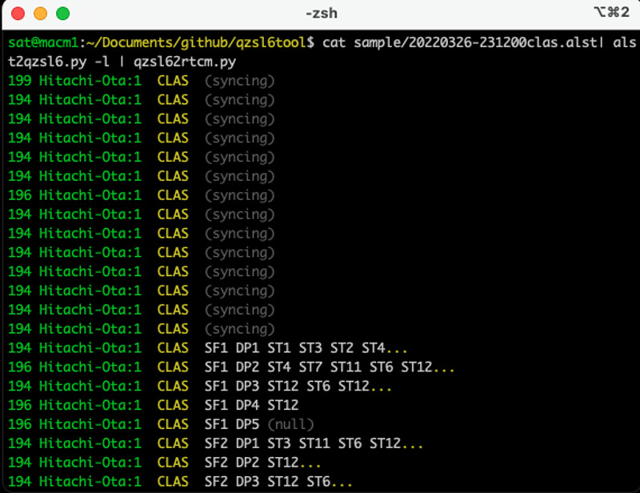

# QZS L6 Tool: quasi-zenith satellite L6-band tool

https://github.com/yoronneko/qzsl6tool

English description is available [here](readme-en.md).

# 概要

これは、準天頂衛星みちびき（QZS: quasi-zenith satellite）がL6周波数帯にて放送するメッセージを表示するツール集です。これは自らの研究のために作成したものですが、多くの方にも役立つと思い公開します。


# アプリケーション・プログラム

このツール集は、メッセージを標準入力で受け取り、変換結果を逐次的に標準出力に出力するpythonプログラムからなります。netcatの``nc``や、[RTKLIB](https://github.com/tomojitakasu/RTKLIB)の``str2str``などを用いれば、ネットワーク上にある情報を活用することも可能です。必要に応じて、標準エラー出力も利用できます。

このコードは、Pythonの``bitstring``モジュールを利用します。``pip3 install bitstring``により、このモジュールをインストールしてください。

このツール集は、
- みちびきL6形式の生データからRTCM形式に変換するプログラム（``qzsl62rtcm.py``）
- みちびきL6帯信号受信機の生データ出力からペイロードを抽出するプログラム（Allystar HD9310C: ``alst2qzsl6.py``、[Pocket SDR](https://github.com/tomojitakasu/PocketSDR): ``pksdr2qzsl6.py``）
- RTCMメッセージを表示するプログラム（``showrtcm.py``）
- GPS時刻とUTC（universal coordinate time）とを相互変換するプログラム（``gps2utc.py``、``utc2gps.py``）
- 緯度・経度・楕円体高座標とECEF（earth-centered earth-fixed）座標とを相互変換するプログラム（``llh2ecef.py``、``ecef2llh.py``）
- Galileo HAS (high accuracy service) ヘッダを表示するプログラム（試験中, ``pksdr2has.py``）

からなります。ディレクトリ構造は次のとおりです。
```
├── img
│   └── test-transmission-of-qzss-madoca-ppp.jpg
├── license.txt
├── python
│   ├── alst2qzsl6.py
│   ├── ecef2llh.py
│   ├── gps2utc.py
│   ├── libcolor.py
│   ├── libeph.py
│   ├── libobs.py
│   ├── libqzsl6.py
│   ├── librtcm.py
│   ├── libssr.py
│   ├── llh2ecef.py
│   ├── pksdr2has.py
│   ├── pksdr2qzsl6.py
│   ├── qzsl62rtcm.py
│   ├── showrtcm.py
│   └── utc2gps.py
├── readme-en.md
├── readme.md
├── sample
│   ├── 2018001A.l6
│   ├── 20211226-082212pocketsdr-clas.txt
│   ├── 20211226-082212pocketsdr-mdc.txt
│   ├── 2022001A.l6
│   ├── 20220326-231200clas.alst
│   ├── 20220326-231200mdc.alst
│   ├── 20220930-115617pocketsdr-e6b.txt
│   ├── 20221130-125237mdc-ppp.alst
│   ├── 20221213-010900.rtcm
│   ├── 20230305-063900pocketsdr-e6b.txt
│   └── readme.txt
└── test
    ├── do_test.sh
    ├── expect
    │   ├── 20211226-082212pocketsdr-clas.l6
    │   ├── 20211226-082212pocketsdr-mdc.l6
    │   ├── 20220326-231200clas.l6
    │   ├── 20220326-231200clas.rtcm
    │   ├── 20220326-231200clas.rtcm.txt
    │   ├── 20220326-231200clas.txt
    │   ├── 20220326-231200mdc.l6
    │   ├── 20220326-231200mdc.rtcm
    │   ├── 20220326-231200mdc.rtcm.txt
    │   ├── 20220326-231200mdc.txt
    │   ├── 20220930-115617pocketsdr-e6b.txt
    │   ├── 20221130-125237mdc-ppp.l6
    │   ├── 20221130-125237mdc-ppp.rtcm
    │   ├── 20221130-125237mdc-ppp.rtcm.txt
    │   ├── 20221130-125237mdc-ppp.txt
    │   ├── 20221213-010900.rtcm.txt
    │   └── 20230305-063900pocketsdr-e6b.txt
    └── readme.md
```

## qzsl62rtcm.py

これは、みちびきL6形式の生データからRTCM形式に変換するプログラムです。オプションを指定しなければ、標準出力に、みちびき管制局やL6メッセージを表示します。

L6形式の生データとして、CLAS（centimeter level augmentation service）、MADOCA（multi-GNSS advanced demonstration tool for orbit and clock analysis）、MADOCA-PPP（Multi-GNSS Advanced Orbit and Clock Augmentation - Precise Point Positioning）を扱えます。また、RTCM（Radio Technical Commission for Maritime Services）形式のメッセージに変換することもできます。

ただし、現状では、CLASやMADOCA-PPPのCompact SSR（state space representation: 空間状態表現）メッセージについては、RTCMメッセージタイプ4073として出力しますので、そのままではRTKLIBなどでの補強メッセージとしては利用できません。


``--help``オプションを与えると、受け付けるオプションを表示できます。

```
usage: qzsl62rtcm.py [-h] [-c] [-m] [-r] [-s] [-t TRACE]

Quasi-zenith satellite (QZS) L6 message to RTCM message converter

options:
  -h, --help            show this help message and exit
  -c, --color           apply ANSI color escape sequences even for non-
                        terminal.
  -m, --message         show display messages to stderr
  -r, --rtcm            send RTCM messages to stdout (it also turns off
                        display messages unless -m is specified).
  -s, --statistics      show CSSR statistics in display messages.
  -t TRACE, --trace TRACE
                        show display verbosely: 1=subtype detail, 2=subtype
                        and bit image.
```

端末出力に対しては、ANSI（アンジー）カラー・エスケープ・シーケンスによりカラー表示します。

端末出力のリダイレクトを行うと、エスケープ・シーケンスは含まれません。リダイレクトを利用すれば、カラー表示をオフにできます（``cat qzss_file.l6 | qzsl62rtcm.py | cat``）。一方、``less``や``lv``などのページャー上でカラー表示するためには、``-c``オプションを利用します。
```
cat qzss_file.l6 | qzsl62rtcm.py -c | lv
cat qzss_file.l6 | qzsl62rtcm.py -c | less -R
```

### CLASメッセージの復号例

例えば、``python``ディレクトリで、次のコマンドにて``qzsl62rtcm.py``の標準入力にL6生データを与えると、その内容が表示されます。
```
cat ../sample/20220326-231200clas.alst | python alst2qzsl6.py -l | python qzsl62rtcm.py

199 Hitachi-Ota:1  CLAS
(...snip...)
194 Hitachi-Ota:1  CLAS
194 Hitachi-Ota:1  CLAS  SF1 DP1 ST1 ST3 ST2 ST4...
196 Hitachi-Ota:1  CLAS  SF1 DP2 ST4 ST7 ST11 ST6 ST12...
(...snip...)
```

``alst2qzsl6.py``は、Allystar受信機で採取したサンプルデータを読み込むプログラムです。これに``-l``オプションを与えると、標準出力にL6生データを出力します。

各行の最初の数値はPRN（pseudo random noise）番号、次のカラムは管制局（常陸太田または神戸）、次の数値（0または1）は送信系番号、その次のカラムはCLASメッセージであることを表します。``SF``はサブフレーム番号、``DP``はデータパート番号を表します。  

Subtype 1メッセージを受信すると、このプログラムはCLASメッセージ解読を開始します。

``...``は、次のデータパートにまでメッセージが続くことを示しています。例えば、上の例において、DP1には、``ST1 ST3 ST2 ST4...``と、DP2には、``ST4 ST7 ST11 ST6 ST12...``と表示されています。これは、DP1にST1、ST3、ST2があり、さらにST4が次のデータパートに続くことを示します。DP2の先頭には``ST4``があり、これはDP1からの継続ST4メッセージです。

一方、``(null)``は、データパート全体が無情報（ヌル）であることを示します。

参考：[QZS L6 ToolのCLASメッセージ対応](https://s-taka.org/qzsl6tool-20220329upd/)

RTKLIBのコマンドラインアプリケーション``str2str``を利用すると、インターネット上で提供されているリアルタイムストリームデータを利用できます。
```
str2str -in ntrip://ntrip.phys.info.hiroshima-cu.ac.jp:80/CLAS 2> /dev/null | alst2qzsl6.py -l | qzsl62rtcm.py
```

``qzsl62rtcm.py``に対して、``-t``オプションとともに数値1または2を与えると、メッセージの詳細を出力します。数値1ではメッセージ内容を、数値2ではメッセージ内容に加えてビットイメージを出力します。

また、``-s``オプションを与えると、サブタイプ1を受信するたびに、統計情報を出力します。
```
stat n_sat 17 n_sig 48 bit_sat 13050 bit_sig 5114 bit_other 1931 bit_null 5330 bit_total 25425
```
``n_sat``は補強対象衛星数を、``n_sig``は信号数を、``bit_sat``は衛星に関する情報ビット数を、``bit_sig``は信号に関する情報ビット数を、``bit_other``は衛星にも信号にも関しない情報ビット数を、``bit_null``は無情報（ヌル）ビット数を、``bit_total``は全メッセージビット数をそれぞれ表します。  
参考：[みちびきアーカイブデータを用いたCLAS衛星補強情報の容量解析](https://s-taka.org/202206ipntj-clas-capacity/)

``qzsl62rtcm.py``に対して、``-r``オプションを与えると、メッセージ内容表示を抑制し、標準出力にRTCMメッセージを出力します。このとき、``-m``オプションも指定すると、標準出力にはRTCMメッセージを、標準エラー出力にはメッセージ内容表示を、それぞれ出力します。

### MADOCAメッセージの復号例

現在、MADOCAメッセージは送信されていません。例えば、``python``ディレクトリで、次のコマンドを実行すると、MADOCAメッセージの内容を表示できます。
```
cat ../sample/20220326-231200mdc.alst | python alst2qzsl6.py -l | python qzsl62rtcm.py

209 Hitachi-Ota:0* MADOCA 2022-03-26 23:11:44 RTCM 1062(26) RTCM 1068(17)
206 Hitachi-Ota:0* MADOCA 2022-03-26 23:11:44 RTCM 1057(8) RTCM 1061(8)
206 Hitachi-Ota:0* MADOCA 2022-03-26 23:11:46 RTCM 1062(26) RTCM 1068(17)
206 Hitachi-Ota:0* MADOCA 2022-03-26 23:11:46 RTCM 1057(8) RTCM 1061(8)
(...snip...)
```
例えば1行目は、PRN 209（みちびき3号機）のもので、常陸太田管制局にある2系統の最初の設備から生成されたメッセージであり、アラートフラグオン（アスタリスク）、時刻、そして、RTCMメッセージタイプとその補強衛星数を表しています。

ここでは、含まれるRTCMメッセージ番号と、括弧書きで補強対象衛星数が表示されます。その中身を観測するためには、``qzsl62rtcm.py``に``-r``オプションを与えることでRTCMメッセージ出力をさせて、``showrtcm.py``にてそのRTCMメッセージを観測します。

```
cat ../sample/20220326-231200mdc.alst | python alst2qzsl6.py -l | python qzsl62rtcm.py -r | python showrtcm.py

RTCM 1062 G SSR hr clock  G01 G02 G03 G05 G06 G07 G08 G09 G10 G12 G13 G15 G16 G1
7 G19 G20 G21 G22 G24 G25 G26 G27 G29 G30 G31 G32 (nsat=26 iod=12)
RTCM 1068 R SSR hr clock  R01 R02 R03 R04 R05 R07 R08 R12 R13 R14 R15 R17 R18 R1
9 R20 R21 R22 (nsat=17 iod=8)
RTCM 1057 G SSR orbit     G10 G12 G13 G15 G16 G17 G19 G20 (nsat=8 iod=13 cont.)
(...snip...)
```

### MADOCA-PPPメッセージの復号例

次のコマンド実行を実行すると、MADOCA-PPPメッセージの内容が出力されます。
```
cat ../sample/20221130-125237mdc-ppp.alst | python alst2qzsl6.py -l | python qzsl62rtcm.py

205 Hitachi-Ota:1  MADOCA-PPP
205 Hitachi-Ota:1  MADOCA-PPP
205 Hitachi-Ota:1  QZNMA
205 Hitachi-Ota:1  QZNMA
205 Hitachi-Ota:1  MADOCA-PPP
205 Hitachi-Ota:1  MADOCA-PPP
205 Hitachi-Ota:1  MADOCA-PPP
205 Hitachi-Ota:1  MADOCA-PPP  SF1 DP1 (Clk/Eph LNAV) ST1 ST2...
205 Hitachi-Ota:1  MADOCA-PPP  SF1 DP2 (Clk/Eph LNAV) ST2...
205 Hitachi-Ota:1  MADOCA-PPP  SF1 DP3 (Clk/Eph LNAV) ST2 ST3
205 Hitachi-Ota:1  MADOCA-PPP  SF1 DP4 (Clk/Eph LNAV) (null)
205 Hitachi-Ota:1  MADOCA-PPP  SF1 DP5 (Clk/Eph LNAV) (null)
(...snip...)
```

インターネット上に提供されているMADOCA-PPPリアルタイムストリームの内容を観測することもできます。
```
str2str -in ntrip://ntrip.phys.info.hiroshima-cu.ac.jp:80/MADOCA 2> /dev/null | alst2qzsl6.py -l | qzsl62rtcm.py
```

参考：[みちびきMADOCA-PPPの試験配信開始](https://s-taka.org/test-transmission-of-qzss-madoca-ppp/)

## showrtcm.py

``showrtcm.py``は、標準入力にてRTCMメッセージを受け取り、標準出力にその内容を表示するコードです。これは、MADOCAの状態空間表現（SSR: state space representation）を解釈することもできます。

``--help``オプションを与えると、受け付けるオプションを表示できます。

```
usage: showrtcm.py [-h] [-c] [-t TRACE]

Quasi-zenith satellite (QZS) L6 message to RTCM message converter

options:
  -h, --help            show this help message and exit
  -c, --color           apply ANSI color escape sequences even for non-
                        terminal.
  -t TRACE, --trace TRACE
                        show display verbosely: 1=subtype detail, 2=subtype
                        and bit image.
```

``showrtcm.py``は、例えば、次のように利用します。

```
cat ../sample/20220326-231200mdc.alst | python alst2qzsl6.py -l | python qzsl62rtcm.py -r | python showrtcm.py

RTCM 1062 G SSR hr clock  G01 G02 G03 G05 G06 G07 G08 G09 G10 G12 G13 G15 G16 G1
7 G19 G20 G21 G22 G24 G25 G26 G27 G29 G30 G31 G32 (nsat=26 iod=12)
```

RTKLIBの``str2str``アプリケーションを用いると、例えば、[RTK基準局](https://s-taka.org/rtk-reference-station/)のRTCMメッセージを表示することも可能です。
```
str2str -in ntrip://ntrip.phys.info.hiroshima-cu.ac.jp:80/OEM7 2> /dev/null | python showrtcm.py

RTCM 1005   Position      34.4401061 132.4147804 233.362
RTCM 1033   Ant/Rcv info  JAVGRANT_G5T NONE s/n 0 rcv "NOV OEM729" ver OM7MR0810RN0000
RTCM 1045 E F/NAV         E30
RTCM 1046 E I/NAV         E30
RTCM 1077 G MSM7          G04 G07 G08 G09 G16 G18 G21 G26 G27
RTCM 1087 R MSM7          R09 R15 R17 R18 R19
RTCM 1097 E MSM7          E02 E03 E10 E11 E25 E30 E34 E36
RTCM 1117 J MSM7          J02 J03 J04 J07
RTCM 1127 C MSM7          C03 C04 C06 C07 C09 C10 C11 C16 C23 C39
RTCM 1127 C MSM7          C01 C02 C12 C25 C28 C34 C37 C40 C43 C59
RTCM 1137 I MSM7          I02 I03 I04 I07
RTCM 1045 E F/NAV         E02
RTCM 1046 E I/NAV         E02
RTCM 1020 R NAV           R17
```

## alst2qzsl6.py

このプログラムは、Allystar HD9310オプションC受信機の生データを標準入力から読み取り、標準出力にその状態を表示します。状態表示の各行において、1列目はPRN番号を、2列目と3列目はGPS週番号と秒を、4列目はC/No [dB Hz]を、5列目はエラーがあればその内容を、それぞれ表します。``--help``オプションで、受け付けるオプションを表示します。
```
usage: alst2qzsl6.py [-h] [-c] [-l] [-m] [-u]

Allystar HD9310 to Quasi-zenith satellite (QZS) L6 message converter

options:
  -h, --help     show this help message and exit
  -c, --color    apply ANSI color escape sequences even for non-terminal.
  -l, --l6       send QZS L6 messages to stdout (it also turns off Allystar
                 and u-blox messages).
  -m, --message  show Allystar messages to stderr.
  -u, --ubx      send u-blox L6 message to stdout (experimental, it also turns
                 off QZS L6 and Allystar messages).
```

``-l``オプションを与えて``alst2qzsl6.py``を実行すると、状態表示の代わりに、L6メッセージを標準出力に出力します。これは、受信できる複数のみちびき衛星のうちで最も信号強度の高い衛星を選択して、その2,000バイトL6生データを標準出力に出力します。``-l``オプションと合わせて``-m``オプションを指定すると、標準出力にL6生データを、標準エラー出力に受信状態を、それぞれ出力します。

``-u``オプションを与えると、標準出力にu-bloxフォーマットでのL6メッセージを出力します。u-blox F9P受信機にこのメッセージを与えると、D9C受信機にて生成したメッセージと同様に、CLAS測位ができるはずです。しかし、まだコードに誤りがあるようで、動作しません。

## pksdr2qzsl6.py

ソフトウェア定義無線器[Pocket SDR](https://github.com/tomojitakasu/PocketSDR)のログファイルから、L6メッセージを抽出するコードです。  
参考：[PocketSDRすごい（L6信号デコード編）](https://s-taka.org/awesome-pocketsdr-l6/#l6e)

## ecef2llh.py

ECEF（earth-centered, earth-fix）座標を緯度・経度・楕円体高に変換します。実行例は、次のとおりです。
```
python ecef2llh.py -3551876.829 3887786.860 3586946.387

34.4401061 132.4147804 233.362
```

## llh2ecef.py

緯度・経度・楕円体高をECEF座標に変換します。実行例は、次のとおりです。
```
python llh2ecef.py 34.4401061 132.4147804 233.362

-3551876.829 3887786.860 3586946.387
```

## gps2utc.py

GPS時刻をUTC時刻に変換します。実行例は、次のとおりです。
```
python gps2utc.py 2238 305575

2022-11-30 12:52:37
```

## utc2gps.py

UTC時刻をGPS時刻に変換します。実行例は、次のとおりです。
```
python utc2gps.py 2022-11-30 12:52:37

2238 305575
```

## pksdr2has.py

Pocket SDR E6B信号ログファイルからGalileo HAS (high accuracy service) メッセージを抽出して、その内容を表示します。``--help``オプションで、受け付けるオプションを表示します。

```
$ pksdr2has.py -h
OMP: Info #276: omp_set_nested routine deprecated, please use omp_set_max_active_levels instead.
usage: pksdr2has.py [-h] [-c] [-m] [-s] [-t TRACE]

Pocket SDR E6B log to HAS message converter

options:
  -h, --help            show this help message and exit
  -c, --color           apply ANSI color escape sequences even for non-terminal.
  -m, --message         show display messages to stderr
  -s, --statistics      show HAS statistics in display messages.
  -t TRACE, --trace TRACE
                        show display verbosely: 1=detail, 2=bit image.
$
```

実行例は、次の通りです。

```
$ python pksdr2has.py -t 2 < ../sample0230305-063900pocketsdr-e6b.txt
OMP: Info #276: omp_set_nested routine deprecated, please use omp_set_max_active_levels instead.
E12 HASS=Operational(1) MT=1 MID=18 MS= 2 PID= 92 -> A new page for MID=18
E10 HASS=Operational(1) MT=1 MID=18 MS= 2 PID= 72
------ HAS decode with the pages of MID=18 MS=2 ------
0x93520062500a7f68c2f5ef002d842a001ec7043fc8c0b3f3cf930253d4e0e9fd9705fad5d5cf670010052353f8b
02202a2047fd0816ffebf4f016011bf9e102007ff000b9ff701d7ed3fd401300bff88021f82fe9aaaaaaaaaaaaaaa
aaaaaaaaaaaaaaaaaaaaaaaaaaaa
------
...
E31 HASS=Operational(1) MT=1 MID=17 MS=11 PID=  9
E11 HASS=Operational(1) MT=1 MID=17 MS=11 PID=134
E12 HASS=Operational(1) MT=1 MID=17 MS=11 PID=161
------ HAS decode with the pages of MID=17 MS=11 ------
0x92ec806220ffbffb2f008140fbffffffeff7fb6fffffc13df914f36824820014a41b2e6a06232012fef014abfef
c1bc0145fd11ec7f9e05fe7feefe90d00080e7f4a0ffa3ff41f14c089fc0002a608ce9bf7391f567e77fd297f5417
3ec067f8600bfb867e68fa6fb44c000010fee97809fe7bf704fff1f8000efbe41f...
------
Time of hour TOH: 2350 s
Mask            : on
Orbit correction: on
Clock full-set  : off
Clock subset    : off
Code bias       : on
Phase bias      : off
Mask ID         : 3
IOD Set ID      : 2
MASK G01 L1 C/A L2 CL L2 P
MASK G02 L1 C/A L2 P
MASK G03 L1 C/A L2 CL L2 P
MASK G04 L1 C/A L2 CL L2 P
MASK G05 L1 C/A L2 CL L2 P
MASK G06 L1 C/A L2 CL L2 P
MASK G07 L1 C/A L2 CL L2 P
MASK G08 L1 C/A L2 CL L2 P
...
```

参考: [Galileo HAS（high accuracy service）その2](https://s-taka.org/galileo-has-part2/), [QZS L6 ToolのHASメッセージ対応](https://s-taka.org/qzsl6tool-20230305upd/)

# ライセンス

このツールキットに[BSD 2-clause license](https://opensource.org/licenses/BSD-2-Clause)を適用します。利用者は、商用・非商用、修正の有無を問わず、このプログラムを利用できますが、この著作権表示が必要です。``librtcm.py``の関数 rtk_crc24q ()[RTKLIB](https://github.com/tomojitakasu/RTKLIB) 2.4.3b34の成果を利用しています。

Copyright (c) 2022 by Satoshi Takahashi  
Copyright (c) 2007-2020 by Tomoji TAKASU
